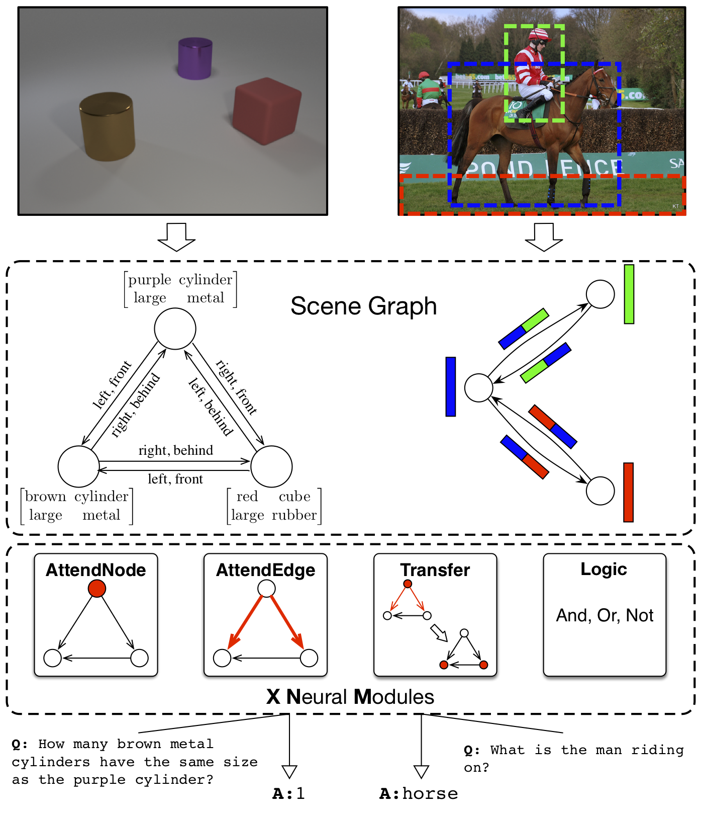
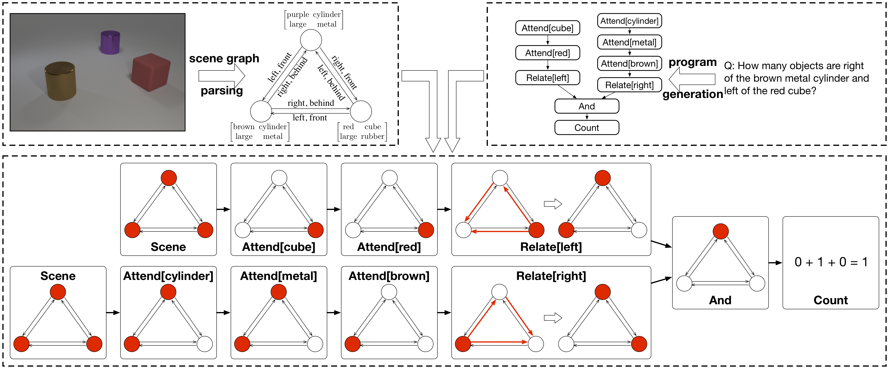

# eXplainable and eXplicit Neural Modules (XNMs)

Pytorch implementation of paper 

**[Explainable and Explicit Visual Reasoning over Scene Graphs](https://arxiv.org/abs/1812.01855)**
<br>
[Jiaxin Shi](https://shijx12.github.io), [Hanwang Zhang](http://www.ntu.edu.sg/home/hanwangzhang/#aboutme), Juanzi Li

Flowchart of our model:

<div align="center">
    
</div><br/>

A visualization of our reasoning process:

<div align="center">
    
</div><br/>

If you find this code useful in your research, please cite
``` tex
@inproceedings{shi2019explainable,
  title={Explainable and Explicit Visual Reasoning over Scene Graphs},
  author={Jiaxin Shi, Hanwang Zhang, Juanzi Li},
  booktitle={CVPR},
  year={2019}
}
```


## Requirements
- python==3.6
- pytorch==0.4.0
- h5py 
- tqdm
- matplotlib


## Experiments
We have 4 experiment settings:
- CLEVR dataset, Det setting (i.e., using detected scene graphs). Codes are in the directory `./exp_clevr_detected`.
- CLEVR dataset, GT setting (i.e., using ground truth scene graphs), attention is computed by softmax function over the label space. Codes are in `./exp_clevr_gt_softmax`.
- CLEVR dataset, GT setting, attention is computed by sigmoid function. Codes are in `./exp_clevr_gt_sigmoid`.
- VQA2.0 dataset, detected scene graphs. Codes are in `./exp_vqa`.

We have a **separate README for each experiment setting** as an instruction to reimplement our reported results.
Feel free to contact me if you have any problems: shijx12@gmail.com

## Acknowledgement
- We refer to the repo [clevr-iep](https://github.com/facebookresearch/clevr-iep) for preprocessing codes.
- Our implementations of module model and dataloader are based on [tbd-net](https://github.com/davidmascharka/tbd-nets).
- Our stacked neural module implementation in `./exp_vqa` is based on Hu's [StackNMN](https://github.com/ronghanghu/snmn).

